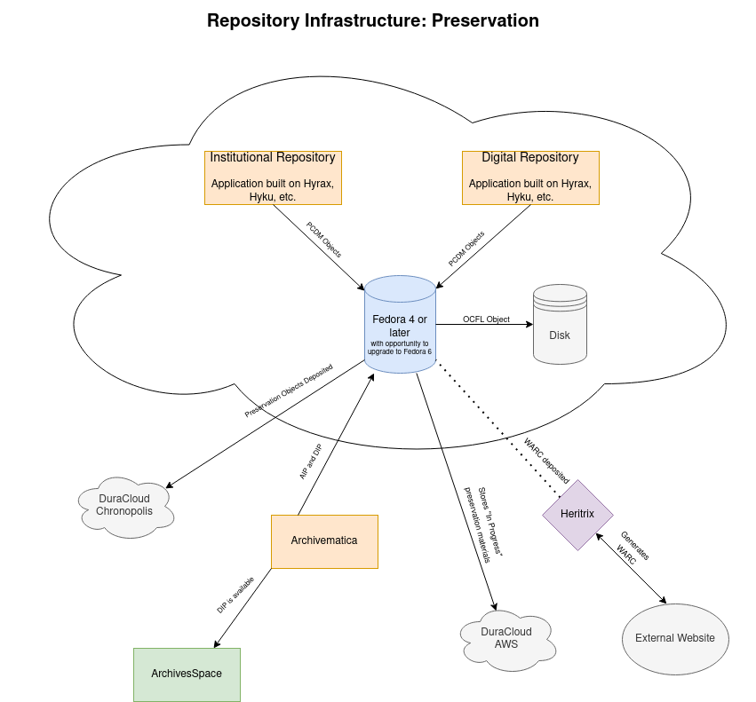

Roadmap for Infrastructure, Preservation, and Interoperability
==============================================================

Introduction
------------

As we set out to develop our next generation repository infrastructure, the University of Tennessee Libraries intends to launch
two new repository applications (one for digital collections and one as an institutional repository). We intend for
these applications to serve content to and interoperate with a variety of other systems.

.. image:: ../images/overall_overview.png

This document describes our current plans and intentions for our repository applications and how these applications will
interoperate with other services.

Preservation Infrastructure
---------------------------

In our next generation repository service, several core technologies will be used to meet our preservation needs and
requirements:

Similar to our current infrastructure, at the heart of our is Fedora. Instead of Fedora 3 as we currently use, our next
generation service must use Fedora 4 or later with the opportunity to migrate to Fedora 6 as soon as possible. Fedora4
or later is important to us for a few reasons.  First, Fedora 4, 5, 6 is built on Linked Data Platform.  This lets us
store all metadata about a digital object in a :code:`fedora:Resource`. It then let's us relate that
:code:`fedora:Resource` to other resources using `Portland Common Data Model <https://github.com/duraspace/pcdm/wiki>`_.

While Fedora 6 is not a requirement for our next repository in order to go live, having a migration path and plan to
Fedora 6 is a requirement.  Fedora 6 is important to us for a few reasons. First, Fedora 6 has much better performance
and scale than Fedora 4 or 5.  This is because Fedora 6 drops its' :code:`ModeShape` dependency.  This techonology has
declined in popularity greatly since Fedora 4 originally launched and is the primary source for performance and scale
issues experienced in Fedora 4 and 5. More importantly, Fedora 6 helps enhance long-term preservation by implementing the
`Oxford Common File Layout (OCFL) <https://ocfl.io/1.0/spec/>`_.

OCFL is a simple, non-proprietary, specified, open standards approach to the layout of the preservation persistence
layer in a repository service. It is designed to be file system agnostic and describes how to layout content on whatever
storage media you choose whether it be bare metal or cloud infrastructure. OCFL enhances long-term preservation in
several ways. First, it is built with **parseability** in mind so that **humans** can understand the content in a disaster
recovery situtation.  This greatly improves our current pair tree infrastructure. Similarly, **parseability** ensures
machine readability which allows for simple applications to be placed on top of an existing OCFL storage root. Next,
OCFL allows for **versioning**. This allows for changes to be tracked over time similar to what we do now. OCFL imporves
on versioning by implementing **forward delta**.  Similar to a diff, forward delta allows for just the difference in a
resource to be kept rather than all additional files.  This feature will help us greatly with our workflows when writing
to DuraCloud Chronopolis. OCFL is also built with **robustness** in mind.  OCFL is designed to protect your repository
from errors, corruption, and migration between storage media (bare metal to cloud and vice versa). This is because OCFL's
strong fixity and use of checksums.  Content can easiliy be validated using its :code:`inventory.json` files. Furthermore,
objects are completely self contained.  This means that everything a human would need to understand a digital object and
its relationships is stored in the OCFL object. Finally, OCFL is focused on **completeness** and is designed to ensure
that a repository can be completely restored by reading in content according to OCFL format and its inventory files.
Unlike Trusted Digital Repositories (ISO 16363), NDSA Levels of Preservation, and Open Archival Information Systems
(OAIS), OCFL does not simply talk about what repositories should do, but what the repository will do.

We want to ensure that our :code:`fedora:Resources` / :code:`OCFL objects` are available for perpetuity regardless of
what happens to our digital library program, applications, or university.  For that reason, we want to deposit our objects
in a dark archive.  For us, this is DuraCloud Chronopolis.  We only deposit "preservation" objects there.  Any proxies or
derivatives related to the object are not stored there.

Last year, a working group between Special Collections and Digital Initiatives wrote
`TOWARD A BORN-DIGITAL PRESERVATION PROGRAM AT UNIVERSITY OF TENNESSEE LIBRARIES <https://docs.google.com/document/d/1AifVR1aF8V6gC6CCA7yWcZHTZOvQv8cOotX1oHd-K-I/edit#heading=h.j8c5tbonpgjs>`_.
This document describes the needs of Special Collections in order to launch a born digital program.  It ultimately led
us to select Archivematica as a solution for more active preservation needs.  By active preservation, we mostly mean the
ability to migrate files when we were not the creators and long-term preservation was not likely in the mind of the
creator.  In the system, an archivist ingests a born digital item and an AIP and a DIP is generated.  The archivist
would also write and acquisition and finding aid in ArchivesSpace. Ultimately, the AIP and DIP should be deposited in
Fedora and ultimately DuraCloud Chronopolis. The DIP should also be managed by Fedora and made available for access in
applications like ArchivesSpace.

Currently, our plans are to support two DuraCloud solutions:  one for dark archiving and one for "dim" archiving.
The dark archiving solution, Chronopolis, is for preservation objects only and for materials that are done and meet our
requirements for dark archiving.  The "dim" archiving solution, DuraCloud AWS, is for objects that are worth of longterm preservation
but are not finished and ready for dark archiving.  For instance, if a preservation object is likely to change or we have
no way of knowing if it may change, we will deposit that object to DuraCloud AWS instead of Chronopolis.  Only when
something is "done" and "complete" from a preservation standard should it be deposited
in Chronopolis.

Finally, Digital Initiatives is interested in developing a web archiving service.  While we are still in the early
planning stages, we are currently planning to use Heritrix for WARC generation and adding those objects to our Fedora
repository for delivery and bit level preservation.  No decisions have been made on how WARCs will be emulated.

Interoperability Between Services
---------------------------------

As we move towards a new repository system, UT Libraries Digital Initiatives plans to focus on a few standards for
interoperability and to serve data for specific use cases: :code:`IIIF` and :code:`OAI-PMH`.

.. image:: ../images/interoperability_overview.png

We see :code:`IIIF` and its specifications as the future for how we provide interoperability between our services. In
the diagram above, two IIIF specifications are mentioned specifically: the :code:`IIIF Image API` and the
:code:`IIIF Presentation API`. The :code:`IIIF Image API` transforms images on the server and allows users of clients to
only get what they need.  A potential use case for this is linking digital objects in a finding aid in ArchivesSpace to
a digital object in a repository service.  To help users get a brief view of what this may be, an image can be generated
on the fly in ArchivesSpace using the IIIF API:

In addition to the image api, we see the :code:`IIIF Presentation API` as the primary way we will serve digital objects
between systems to meet a variety of user and client needs. The :code:`IIIF Presentation API` allows us to create recipes
for different content models and use cases so that our content can be served in viewers in ways that best fit our needs.
In order to think about serving content across different systems with the :code:`IIIF Presentation API`, UT Libraries
Digital Initiatives maintains a `UTK IIIF Cookbook <https://utk-iiif-cookbook.readthedocs.io/en/latest/>`_. Here is an
example of an "embedded recipe" for thinking about serving our oral histories:

.. raw:: html

    <iframe src="https://uv-v3.netlify.app/uv/uv.html#?manifest=https://raw.githubusercontent.com/utkdigitalinitiatives/utk_iiif_recipes/main/raw_manifests/rfta_video.json&c=undefined&m=0&s=0&cv=0&rid=undefined" width="560" height="420" allowfullscreen frameborder="0"></iframe>

The sample manifest can be found `here <https://raw.githubusercontent.com/utkdigitalinitiatives/utk_iiif_recipes/main/raw_manifests/rfta_video.json>`_.

While we intend to use :code:`OAI-PMH` for the time being, we view it as a legacy technology that we will eventually
abandon. Instead, we believe that the `IIIF Change Discovery API <https://iiif.io/api/discovery/0.3/>`_ is how we will
eventually find and share metadata and the objects that the metadata represents between services. We recognize that the
API is in beta and not stable enough to develop against, we feel strongly that this is where we and other libraries will
eventually implement for sharing.

While we see IIIF as our future and plan to focus on it heavily, we realize that we are still in
need of :code:`OAI-PMH` for the near future. This technology is what we use to serve metadata to our aggregation service
and on to services such as DPLA, tn.dp.la, and our Ex Libris Primo instance.  While the technology is very old, we
it is what our current external services rely on.  While it would be possible to move away from it entirely, it would be
expensive to do so at this time. For instance, if we moved away from OAI-PMH for DPLA, it would require DPLA to rewrite
all normalization and this task would be entirely outside our control.  Similarly, while other solutions exist for Ex
Libris Primo for external discovery import profiles, these have never been explored or implemented here and would require
reenvisioning and a total reimplementation of workflows.
