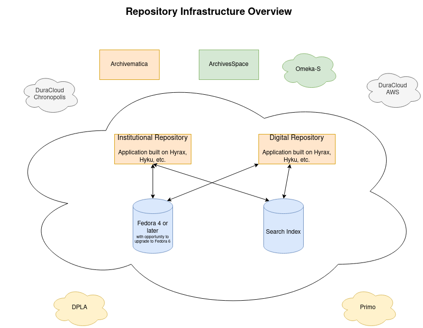

Overall Infrastructure, Preservation, and Interoperability
==========================================================

Introduction
------------

As we set out to develop our next generation repository infrastructure, the University of Tennessee Libraries intends to launch
two new repository applications (one for digital collections and one as an institutional repository). We intend for
these applications to serve content to a variety of other systems.

This document describes our current plans and intentions for our repository applications and how these applications will
interoperate with other services.

Preservation Infrastructure
---------------------------

In our next generation repository service, several core technologies will be used to meet our preservation needs and
requirements:

.. image:: ../images/preservation_overview.png

Similar to our current infrastructure, at the heart of our is Fedora. Instead of Fedora 3 as we currently use, our next
generation service must use Fedora 4 or later with the opportunity to migrate to Fedora 6 as soon as possible. Fedora4
or later is important to us for a few reasons.  First, Fedora 4, 5, 6 is built on Linked Data Platform.  This lets us
store all metadata about a digital object in a :code:`fedora:Resource`. It then let's us relate that
:code:`fedora:Resource` to other resources using `Portland Common Data Model <https://github.com/duraspace/pcdm/wiki>`_.

While Fedora 6 is not a requirement for our next repository in order to go live, having a migration path and plan to
Fedora 6 is a requirement.  Fedora 6 is important to us for a few reasons. First, Fedora 6 has much better performance
and scale than Fedora 4 or 5.  This is because Fedora 6 drops its' :code:`ModeShape` dependency.  This techonology has
declined in popularity greatly since Fedora 4 originally launched and is the primary source for performance and scale
issues experienced in Fedora 4 and 5. More importantly, Fedora 6 helps enhance long-term preservation by implementing the
`Oxford Common File Layout (OCFL) <https://ocfl.io/1.0/spec/>`_.

OCFL is a simple, non-proprietary, specified, open standards approach to the layout of the preservation persistence
layer in a repository service. It is designed to be file system agnostic and describes how to layout content on whatever
storage media you choose whether it be bare metal or cloud infrastructure. OCFL enhances long-term preservation in
several ways. First, it is built with **parseability** in mind so that **humans** can understand the content in a disaster
recovery situtation.  This greatly improves our current pair tree infrastructure. Similarly, **parseability** ensures
machine readability which allows for simple applications to be placed on top of an existing OCFL storage root. Next,
OCFL allows for **versioning**. This allows for changes to be tracked over time similar to what we do now. OCFL imporves
on versioning by implementing **forward delta**.  Similar to a diff, forward delta allows for just the difference in a
resource to be kept rather than all additional files.  This feature will help us greatly with our workflows when writing
to DuraCloud Chronopolis. OCFL is also built with **robustness** in mind.  OCFL is designed to protect your repository
from errors, corruption, and migration between storage media (bare metal to cloud and vice versa). This is because OCFL's
strong fixity and use of checksums.  Content can easiliy be validated using its :code:`inventory.json` files. Furthermore,
objects are completely self contained.  This means that everything a human would need to understand a digital object and
its relationships is stored in the OCFL object. Finally, OCFL is focused on **completeness** and is designed to ensure
that a repository can be completely restored by reading in content according to OCFL format and its inventory files.
Unlike Trusted Digital Repositories (ISO 16363), NDSA Levels of Preservation, and Open Archival Information Systems
(OAIS), OCFL does not simply talk about what repositories should do, but what the repository will do.

We want to ensure that our :code:`fedora:Resources` / :code:`OCFL objects` are available for perpetuity regardless of
what happens to our digital library program, applications, or university.  For that reason, we want to deposit our objects
in a dark archive.  For us, this is DuraCloud Chronopolis.  We only deposit "preservation" objects there.  Any proxies or
derivatives related to the object are not stored there.

Last year, a working group between Special Collections and Digital Initiatives wrote
`TOWARD A BORN-DIGITAL PRESERVATION PROGRAM AT UNIVERSITY OF TENNESSEE LIBRARIES <https://docs.google.com/document/d/1AifVR1aF8V6gC6CCA7yWcZHTZOvQv8cOotX1oHd-K-I/edit#heading=h.j8c5tbonpgjs>`_.
This document describes the needs of Special Collections in order to launch a born digital program.  It ultimately led
us to select Archivematica as a solution for more active preservation needs.  By active preservation, we mostly mean the
ability to migrate files when we were not the creators and long-term preservation was not likely in the mind of the
creator.  In the system, an archivist ingests a born digital item and an AIP and a DIP is generated.  The archivist
would also write and acquisition and finding aid in ArchivesSpace. Ultimately, the AIP and DIP should be deposited in
Fedora and ultimately DuraCloud AWS. The DIP should also be made available in ArchivesSpace.

Currently, our plans are to have two separate DuraCloud solutions:  one for dark archiving and one for "dim" archiving.
The dark archiving solution, Chronopolis, is for preservation objects only and for materials that are done and meet our
requirements for dark archiving.  The "dim" archiving solution, AWS, is for things where there are questions or that we
in Digital Initiatives have limited control.  For instance, if a preservation object may change, we'd deposit to AWS
instead of Chronopolis.  Only when something is "done" and "complete" from a preservation standard should it be deposited
in Chronopolis.

Interoperability Between Services
---------------------------------

