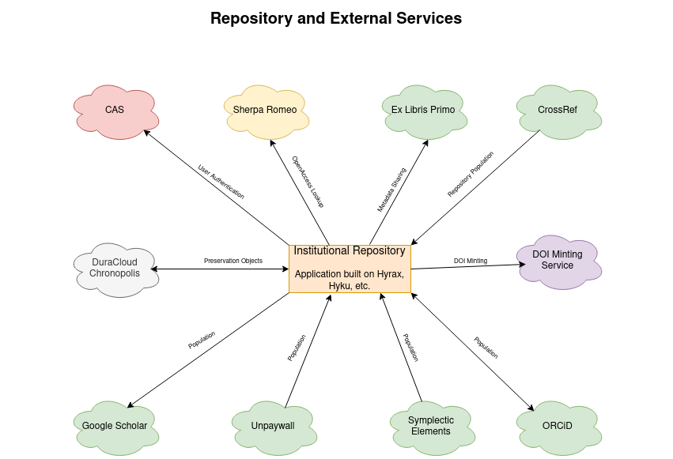

External Services and Interoperability
======================================

As stated in the functional requirements section of our RFP, there are a number of technologies that we would love our
application to interoperate with.  While some are more important than others and only a few are requirements, the diagram
below lists them:

For authentication, CAS or Shibboleth is a must have for us to be able to go live. Having CAS for authentication is in
line with expectations from central IT, keeps us out of the authentication game, and allows our students, faculty, and
staff additional security with two factor authentication.

Unquestionably, interoperability with Google Scholar is our most important integration with an external service. We want
to be confident that the original scholarship of students and faculty appears in Google Scholar's search index. Also,
since we intend for the repository to include electronic theses and dissertations, data sets, and some forms of grey
literature, ensuring metatags are applied appropriately across the repository is extremely important for us.

Another important service is DOI minting.  We want to allow users to mint DOIs or have that happen for them automatically
in specific use cases in our next system.

Preserving original scholarship is also very important for us.  For this reason, we will sync our Fedora resources with
DuraCloud Chronopolis or AWS.

We realize that our repository is limited in use without content. Because of this, we feel its important to find ways to
autopopulate it or make it very easy to someone else to add content. Similarly, we feel its important where possible for
the repository to populate other services.  Here are some of the ways we'd like our repository to interoperate with other
services:

* **ORCiD**:  we would like to be able to pull publications from the profiles of authors affiliated with UTK. Similarly, we'd like to be able to populate ORCiD profiles with content from our repository.
* **Unpaywall**: we would like to populate our repository based on open access discovery in the `Unpaywall <https://unpaywall.org/>`_ service.
* **Crossref**: we would like to populate the repository with content from university affiliated researchers in Crossref based on existing metadata.
* **Symplectic Elements**: we would like to allow faculty to populate the repository based on content in their Symplectic Elements profile.
* **Ex Libris Primo**: we would like to share our metadata with our OneSearch index based on Ex Libris Primo via OAI-PMH.

Finally, we would like to help our students, researchers, and faculty to make informed decisions about their rights to
add their publications by integrating with `Sherpa Romeo <https://v2.sherpa.ac.uk/romeo/>`_.
