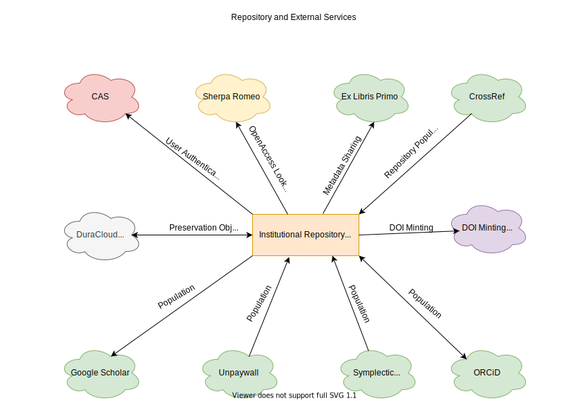

External Services and Interoperability
======================================

As stated in the functional requirements section of our RFP, there are a number of technologies that we would love our
application to interoperate with.  While some are more important than others and only a few are requirements, the diagram
below lists them:

For authentication, CAS or Shibboleth is a must have for us to be able to go live. Having CAS for authentication is in
line with expectations from central IT, keeps us out of the authentication game, and allows our students, faculty, and
staff additional security with two factor authentication.

Unquestionably, interoperability with Google Scholar is our most important integration with an external service. We want
to be confident that the original scholarship of students and faculty appears in Google Scholar's search index. Also,
since we intend for the repository to include electronic theses and dissertations, data sets, and some forms of grey
literature, ensuring metatags are applied appropriately across the repository is extremely important for us.

Another important service is DOI minting.  We want to allow users to mint DOIs or have that happen for them automatically
in specific use cases in our next system.

Preserving original scholarship is also very important for us.  For this reason, we will sync our Fedora resources with
DuraCloud Chronopolis or AWS.

We realize that the best way to get people to use our repository is by looking for avenues to populate it appropriately.
Similarly, we would also like for the repository to populate other services.  Here are a few examples:

* ORCiD
* Unpaywall
* Crossref
* Symplectic Elements
* Ex Libris Primo

Sherpa romeo