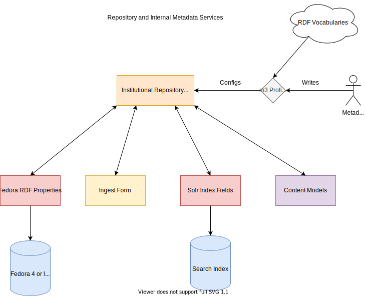

Metadata and Internal Services
==============================

In our next generation institutional repository, we would like a system that allows for flexible metadata within a
Hyrax-based application. The diagram below highlights how this system may work:

In it, a metadata librarian would create a m3 profile based on the `Houndstooth module <https://github.com/samvera-labs/houndstooth>`_.
This module would inform our various content models and mappings to external services. It would include the RDF properties
that we want to use, their ranges, and the property URI to which they relate. The profile and its properties would inform
the application in numerous ways including what fields appear when you view the object on the web, what fields are available
to a user when completing a webform, and how the descriptive metadata related to an object is mapped to a search index
or other external service.
