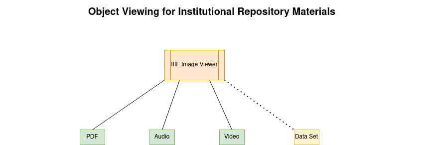

Object Viewing
==============

Compared to our Digital Collections repository, we have minimal requirements and expectations for how objects should be
delivered in our institutional repository.  As we state in our
`Overall Infrastructure, Preservation, and Interoperability <0_Repository_Infrastructure.rst>`_ section, we intend to
use IIIF and its various API specifications for interoperability.  Therefore, we would like to follow IIIF
and present content to viewers such as `Univeral Viewer <https://universalviewer.io/>`_ via the IIIF presentation API
where possible.

In the institutional repository, we believe we will likely be dealing with four types of files primarily:

PDFs, audio, and videos should all be serveable to a viewer via the IIIF presentation api.  When possible, we would also
like to serve parts of data sets to a viewer but minimally we simply want to provide a way for a user to download the
file so that it can be associated with a program locally.