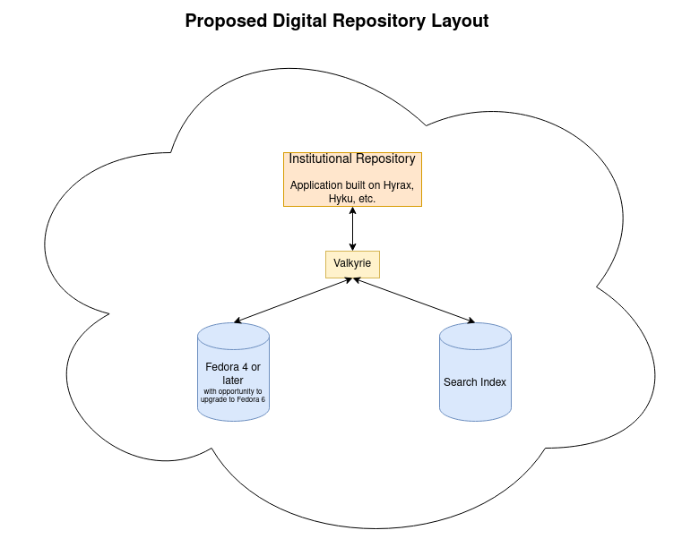

Digital Collections Overview
----------------------------

As described in `Overall Infrastructure, Preservation, and Interoperability <0_Repository_Infrastructure.rst>`_, our next
digital collections repository will be hoested in a single, Hyrax-based application. Historically, we've kept our institutional
repository and digital collections repository separate as they serve different content, have different use cases, and have
different requirements and workflows.

While there are reasons for these two applications to be separate, we see no fundamental reason why they should not or could not use
a shared Fedora repository or search and indexing application. We also recognize that there may be certain technical reasons
why these technologies too should be separate. If we were to use the same search index, we will ensure that we are
able to limit results to one application as a default search and not retrieve results from both applications by default.

As we previously stated, we intend for the application to be Hyrax-based. We recognize that the Hyrax community sees
`Valkyrie <https://github.com/samvera/valkyrie>`_ as a necessary replacement for ActiveFedora. We also recognize that
Valkyrie allows the repository application to be extensibile and use a variety of storage backends and other internal
service layers. That being said, it is possible that our new repository may use ActiveFedora initially as Valkyrie is
still being actively developed.

Finally, as stated in `Overall Infrastructure, Preservation, and Interoperability <0_Repository_Infrastructure.rst>`_,
we aspire to use Fedora 6 and OCFL as soon as possible.  With that being said, we are not opposed to our initial
repository service going live Fedora 4 or 5 as long as we have a road map up front for migrating to Fedora 6 as soon as
possible. For more information about reasons for this, see the document above.