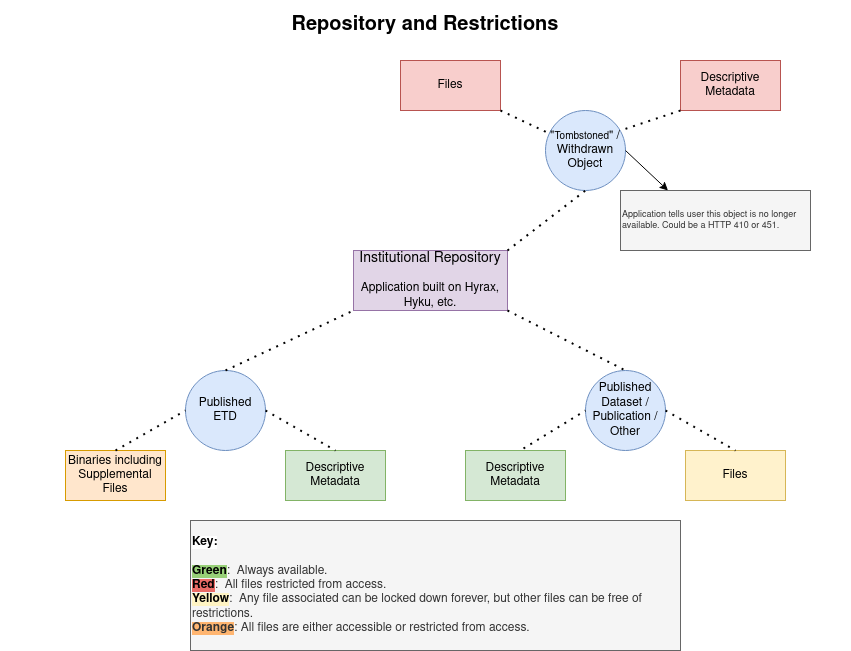

Restrictions on Access
======================

In our next generation institutional repository, certain content models must be flexible towards restrictions on access.
The diagram below describes this:

When an electronic thesis or dissertation is published, its metadata should always be publically available. Its primary
object such as a PDF and supplementary files may be embargoed and restricted from access for up to six years.  When this
happens, we expect for the embargo to apply to all files.

Other content such as data sets, articles, or other publications are similar.  When published, their metadata should always
be available.  However, the primary object and any attached supplementary files may be restricted from access.  These
restrictions should be file to file and not based on the overall object. In these cases, the descriptive metadata should
always be available.

Metadata should only be restricted from published materials in the case that the object has been tombstoned. Tombstones
occur in the rare cases where plagarism or another form of academic violation has occurred. When this happens, the
repository must not provide the object or its metadata on request but instead redirect the user to a message stating that
the object in question had been removed.
